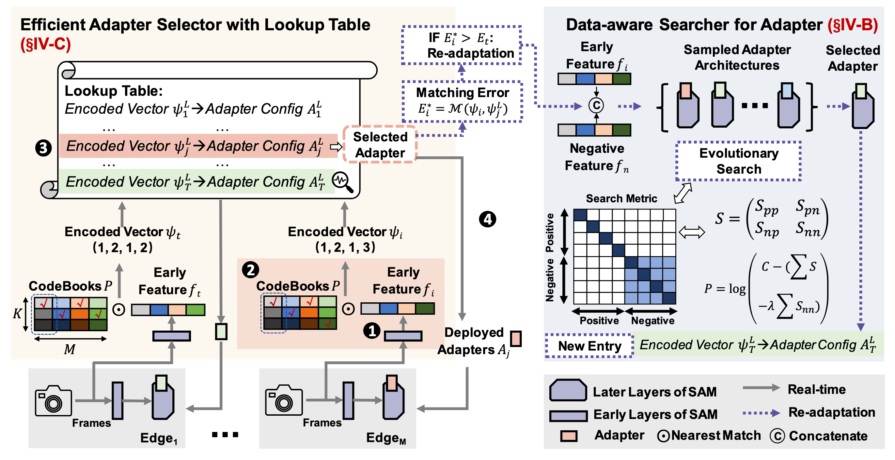

AdaptiveSAM
=========================
By [Muyao Yuan](https://muyaoyuan.github.io)* and [Yuanhong Zhang](https://scholar.google.com/citations?user=IMjuhnQAAAAJ)* (*: Equal contribution)

* This is the official repository for *Dynamic Adapters for Enabling Continuous Edge Video Analytics with Segment Anything Model*.

# Introduction

<p align="center">

</p>

**Abstract.** The emergence of the Segment Anything Model (SAM), a visual foundation model, promises significant advancements in edge continuous video analytics. However, the high demands of resources and dynamic application needs hinder the practical deployment in dynamic video scenes. Traditional continuous video analytics systems focus on small models, relying on massive retraining and evaluation to alleviate data drifts, which is resource-intensive for SAM. Alternatively, existing fine-tuning strategies for SAM, designed for predefined tasks, are constrained by the limited representational capacity of its rigid architecture, which hinders its ability to manage continuous drift. In this work, we propose AdaptiveSAM, the first continuous video analytics system for SAM, empowering continuous inference by data-aware dynamic adapter architectures and efficient table lookup. Specifically, we design a zero-cost adapter search algorithm that determines adapter structures for the current scenario. Our proposed dynamic adapters expand the model's representational ability compared to rigid architectures, avoiding repeatedly retraining the entire model and mitigating catastrophic forgetting. Next, we introduce a lookup-based inference paradigm that leverages centroid learning to represent diverse scenes. During inference, the system efficiently selects the most suitable adapters through fine-grained feature matching and triggers a re-adaptation process when the matching error becomes unacceptable (i.e., indicating significant data drift).


# Installation

Recommended environment:

- `python==3.8`
- `torch==1.8.0`
- `torchvision==0.9.0`

Please follow the instructions [here](https://pytorch.org/get-started/locally/) to install PyTorch and TorchVision with CUDA support.

Clone the repository locally and install with:

```bash
git clone https://github.com/MuyaoYuan/AdaptiveSAM.git
cd AdaptiveSAM
pip install -e .
pip install -r requirements.txt
```

# Model Checkpoint

AdaptiveSAM expects a MobileSAM checkpoint before running.

- [Official MobileSAM repository](https://github.com/ChaoningZhang/MobileSAM)
- Default checkpoint path: `ckpt/mobile_sam.pt`
- If needed, pass a custom checkpoint path with `--snapshot`

# Run

Main entry:

```bash
bash config/MobileSAM_AdaptiveSAM.sh
```


# Acknowledgement
The code and some instructions are built upon the official [Segment Anything Model repository](https://github.com/facebookresearch/segment-anything) and [MobileSAM repository](https://github.com/ChaoningZhang/MobileSAM).

# License

The repository is licensed under the [Apache 2.0 license](LICENSE).
